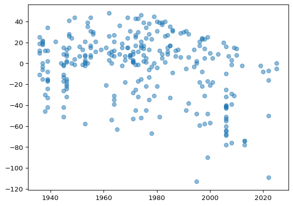
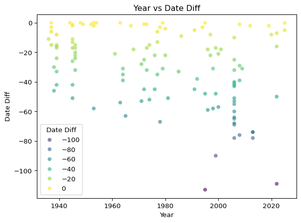
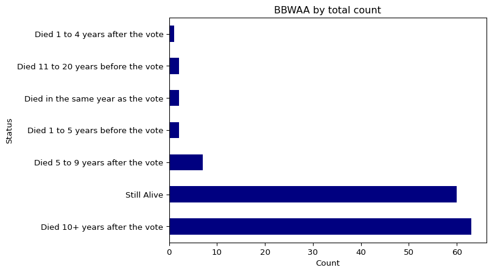
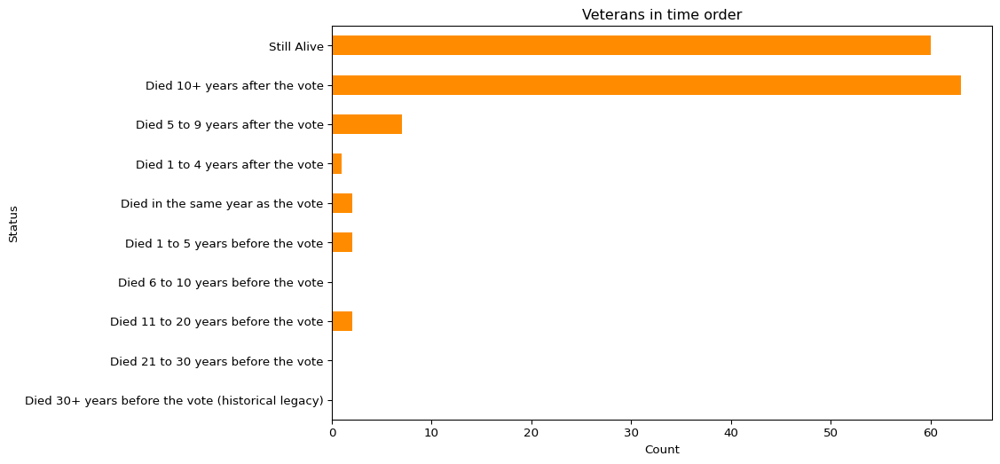
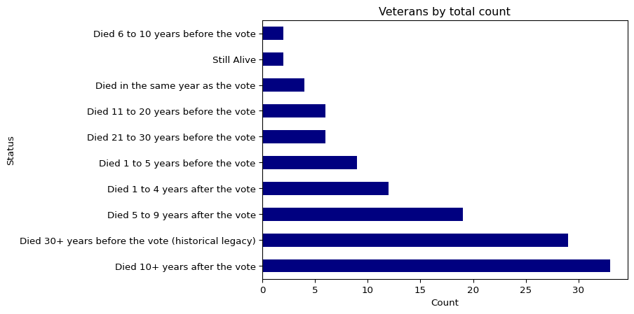
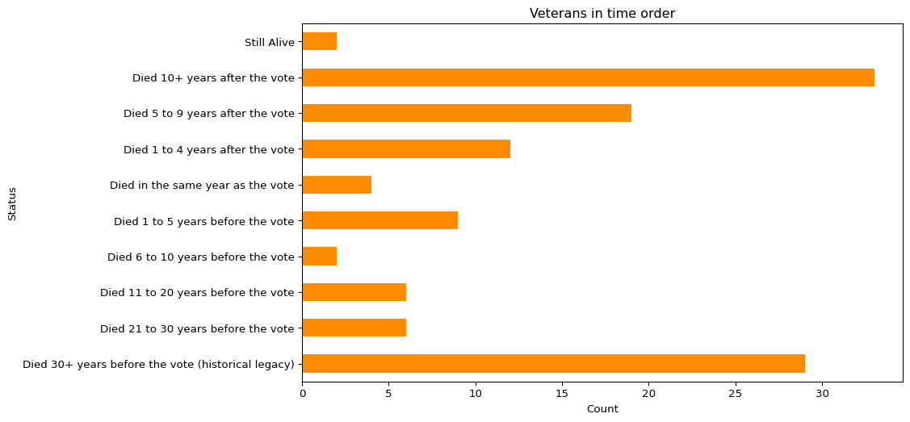
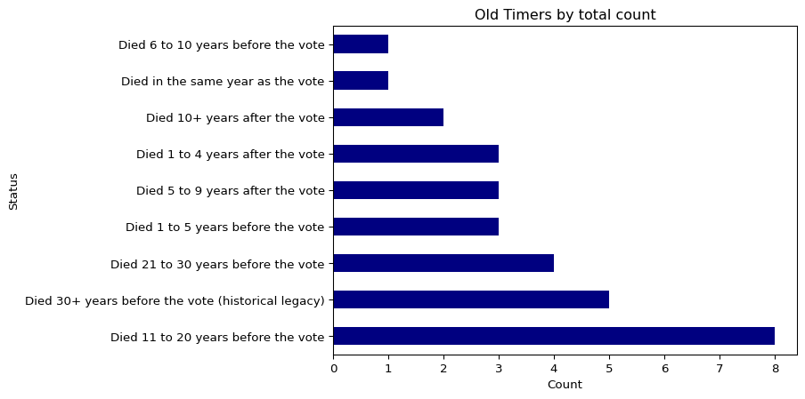
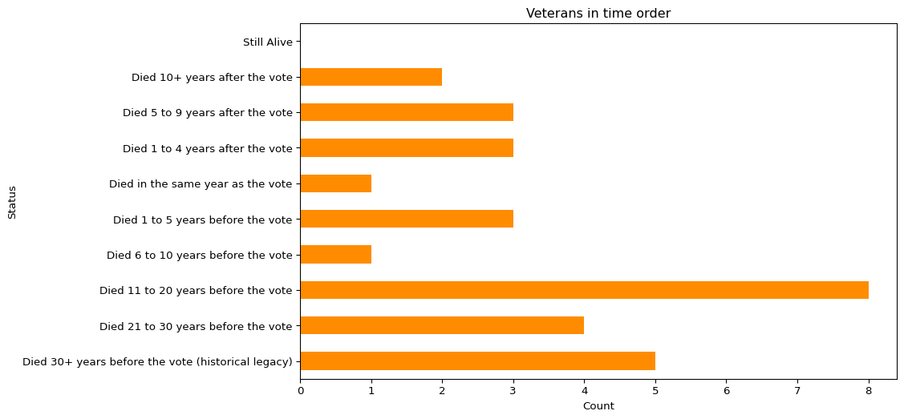
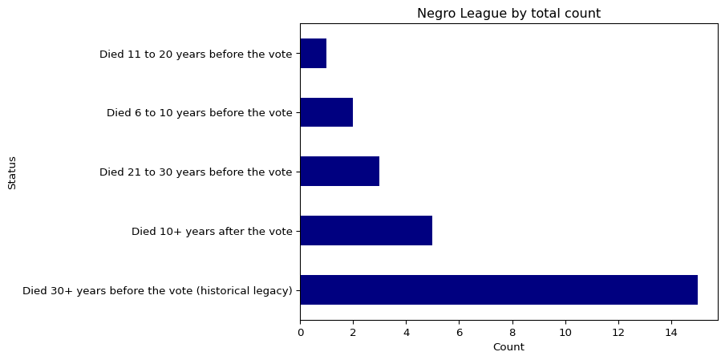
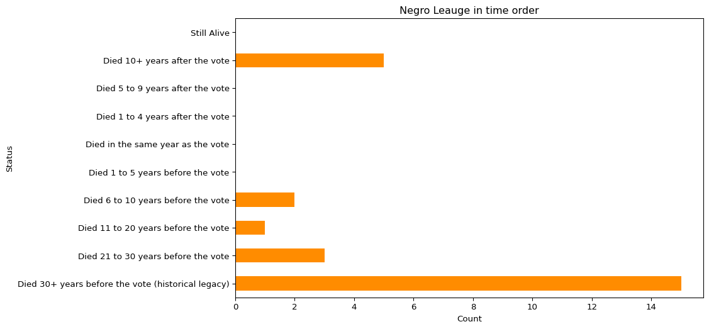

# My_Personal_Beef_with_the_Baseball_HOF


# The Morbid Mathematics of Hall of Fame Voting

Okay, let’s be real. I did this whole data thing for one reason: I’m
still mad about Ron Santo.

First, full disclosure: I loved Ron Santo so much I named my dog after
him. Yes, my beloved mut is named Santo. He’s a good boy who deserves
better than the raw deal his namesake got from those Hall of Fame
voters.

So there I was, crying for the hundredth time watching “This Old Cub”—if
you haven’t seen it, it follows Ron Santo’s life battling Type 1
Diabetes while being the heart of the Chicago Cubs Organization. And the
part that absolutely wrecks me? His widow Vicki answering the phone in
their empty house to hear the news: “Ron’s been elected to the Hall of
Fame.”

# One year after he died. ONE. YEAR.

This got me thinking: Are Hall of Fame voters just… ghouls? Do they only
appreciate greatness once someone’s six feet under? I mean, Ron waited
his entire life for that call. He’d literally gather his family around
the phone every voting day, hoping. Nothing.

Then he dies. Suddenly he’s Hall-worthy.

# So I spent an hour with Python asking: Do dead players get more votes?

``` python
import pandas as pd
```

``` python
HOF = pd.read_csv("C:/Users/court/Downloads/Data_Deep_Dive_Ron_Santo_HOF\HOF.csv")
HOF
```

<div>
<style scoped>
    .dataframe tbody tr th:only-of-type {
        vertical-align: middle;
    }
&#10;    .dataframe tbody tr th {
        vertical-align: top;
    }
&#10;    .dataframe thead th {
        text-align: right;
    }
</style>

|  | Year | Name | Unnamed: 2 | Voted By | Inducted As | Votes | % of Ballots | Name-additional |
|----|----|----|----|----|----|----|----|----|
| 0 | 2026 | Jeff Kent | 1968-Living | Veterans | Player | NaN | NaN | kentje01 |
| 1 | 2025 | Dick Allen | 1942-2020 | Classic Baseball Era | Player | NaN | NaN | allendi01 |
| 2 | 2025 | Dave Parker | 1951-2025 | Classic Baseball Era | Player | NaN | NaN | parkeda01 |
| 3 | 2025 | CC Sabathia | 1980-Living | BBWAA | Player | 342.0 | 86.8% | sabatc.01 |
| 4 | 2025 | Ichiro Suzuki | 1973-Living | BBWAA | Player | 393.0 | 99.7% | suzukic01 |
| ... | ... | ... | ... | ... | ... | ... | ... | ... |
| 347 | 1936 | Ty Cobb | 1886-1961 | BBWAA | Player | 222.0 | 98.2% | cobbty01 |
| 348 | 1936 | Walter Johnson | 1887-1946 | BBWAA | Player | 189.0 | 83.6% | johnswa01 |
| 349 | 1936 | Christy Mathewson | 1880-1925 | BBWAA | Player | 205.0 | 90.7% | mathech01 |
| 350 | 1936 | Babe Ruth | 1895-1948 | BBWAA | Player | 215.0 | 95.1% | ruthba01 |
| 351 | 1936 | Honus Wagner | 1874-1955 | BBWAA | Player | 215.0 | 95.1% | wagneho01 |

<p>352 rows × 8 columns</p>
</div>

# This Data is pulled directly from www.baseball-reference.com

``` python
HOF = HOF.rename(columns={'Unnamed: 2':'Dates'})
HOF
```

<div>
<style scoped>
    .dataframe tbody tr th:only-of-type {
        vertical-align: middle;
    }
&#10;    .dataframe tbody tr th {
        vertical-align: top;
    }
&#10;    .dataframe thead th {
        text-align: right;
    }
</style>

|  | Year | Name | Dates | Voted By | Inducted As | Votes | % of Ballots | Name-additional |
|----|----|----|----|----|----|----|----|----|
| 0 | 2026 | Jeff Kent | 1968-Living | Veterans | Player | NaN | NaN | kentje01 |
| 1 | 2025 | Dick Allen | 1942-2020 | Classic Baseball Era | Player | NaN | NaN | allendi01 |
| 2 | 2025 | Dave Parker | 1951-2025 | Classic Baseball Era | Player | NaN | NaN | parkeda01 |
| 3 | 2025 | CC Sabathia | 1980-Living | BBWAA | Player | 342.0 | 86.8% | sabatc.01 |
| 4 | 2025 | Ichiro Suzuki | 1973-Living | BBWAA | Player | 393.0 | 99.7% | suzukic01 |
| ... | ... | ... | ... | ... | ... | ... | ... | ... |
| 347 | 1936 | Ty Cobb | 1886-1961 | BBWAA | Player | 222.0 | 98.2% | cobbty01 |
| 348 | 1936 | Walter Johnson | 1887-1946 | BBWAA | Player | 189.0 | 83.6% | johnswa01 |
| 349 | 1936 | Christy Mathewson | 1880-1925 | BBWAA | Player | 205.0 | 90.7% | mathech01 |
| 350 | 1936 | Babe Ruth | 1895-1948 | BBWAA | Player | 215.0 | 95.1% | ruthba01 |
| 351 | 1936 | Honus Wagner | 1874-1955 | BBWAA | Player | 215.0 | 95.1% | wagneho01 |

<p>352 rows × 8 columns</p>
</div>

``` python
HOF[['DOB','Date2']] = HOF['Dates'].str.split("-", expand=True)
```

``` python
import numpy as np

def Living(x):
    if x == 'Living':
        return "0"
    else:
        return x

HOF['DOD'] = HOF['Date2'].apply(Living)
```

``` python
HOF.dtypes
```

    Year                 int64
    Name                object
    Dates               object
    Voted By            object
    Inducted As         object
    Votes              float64
    % of Ballots        object
    Name-additional     object
    DOB                 object
    Date2               object
    DOD                 object
    dtype: object

``` python
HOF['DOD'] = pd.to_numeric(HOF['DOD'], errors='coerce').fillna(0).astype(int)
HOF['Year'] = HOF['Year'].astype(int)
```

``` python
HOF.dtypes
```

    Year                 int64
    Name                object
    Dates               object
    Voted By            object
    Inducted As         object
    Votes              float64
    % of Ballots        object
    Name-additional     object
    DOB                 object
    Date2               object
    DOD                  int64
    dtype: object

``` python
HOF['Date Diff'] = (HOF['DOD'] - HOF['Year']).where(HOF['DOD'] != 0, np.nan)
```

``` python
import matplotlib.pyplot as plt

plt.scatter(HOF['Year'], HOF['Date Diff'], alpha=0.5)
plt.show()
```



``` python
# USE THIS FOR LATER!!!

HOF2 = HOF.copy()
```

``` python
HOF['Date Diff'] = HOF['Date Diff'].where(HOF['Date Diff'] <= 0)
```

# Getting a rough idea where the trend may lie

``` python
import seaborn as sns

sns.scatterplot(x='Year', y='Date Diff', data=HOF, alpha=0.6, hue='Date Diff', palette='viridis')
plt.title('Year vs Date Diff')
plt.show()
```



# Let's see the split of those who died before and after the vote  

``` python
print("Died after Vote:", (HOF2['Date Diff'] > 0).sum())
print("Died before Vote:", (HOF2['Date Diff'] < 0).sum())
print("Still Alive", HOF2['Date Diff'].isna().sum())
```

    Died after Vote: 153
    Died before Vote: 113
    Still Alive 77

``` python
DD_sorted = HOF['Date Diff'].value_counts().sort_values(ascending=False)
DD_sorted
```

    Date Diff
     0.0     9
    -1.0     6
    -2.0     5
    -17.0    5
    -31.0    4
            ..
    -63.0    1
    -20.0    1
    -26.0    1
    -46.0    1
    -30.0    1
    Name: count, Length: 61, dtype: int64

# Let’s break the data down more into some custom buckets based off of the data

``` python
def bucket_all_values(value):
    if pd.isna(value):
        return 'NaN'
    if value == 0:
        return '0'
    
    #  Died after the vote
    elif value > 0:
        if value < 5:
            return '1 to 5'
        elif value < 10:
            return '5 to 10'
        elif value < 15:
            return '10 to 15'
        elif value < 20:
            return '15 to 20'
        elif value < 25:
            return '20 to 25'
        elif value < 30:
            return '25 to 30'
        elif value < 35:
            return '30 to 35'
        elif value < 40:
            return '35 to 40'
        elif value < 45:
            return '40 to 45'
        elif value < 50:
            return '45 to 50'
        else:
            return '50+'
    
    # Died before the vote
    else:  
        if value > -5:
            return '-1 to -5'
        elif value > -10:
            return '-5 to -10'
        elif value > -15:
            return '-10 to -15'
        elif value > -20:
            return '-15 to -20'
        elif value > -25:
            return '-20 to -25'
        elif value > -30:
            return '-25 to -30'
        elif value > -35:
            return '-30 to -35'
        elif value > -40:
            return '-35 to -40'
        elif value > -45:
            return '-40 to -45'
        elif value > -50:
            return '-45 to -50'
        else:
            return '-50 and below'

bucketed = HOF2['Date Diff'].apply(bucket_all_values)

counts = bucketed.value_counts()
counts
```

    Date Diff
    NaN              77
    5 to 10          29
    -50 and below    28
    15 to 20         23
    10 to 15         23
    1 to 5           17
    20 to 25         16
    -1 to -5         15
    25 to 30         14
    -15 to -20       14
    30 to 35         11
    -30 to -35       10
    0                 9
    -5 to -10         9
    -20 to -25        9
    35 to 40          9
    40 to 45          8
    -40 to -45        7
    -45 to -50        6
    -10 to -15        5
    -35 to -40        5
    -25 to -30        5
    45 to 50          3
    Name: count, dtype: int64

``` python
def bucket_all_values(value):
    if pd.isna(value):
        return 'Still Alive'
    
    # Died after the vote
    elif value > 0:
        if value < 5:
            return 'Died 1 to 4 years after the vote'
        elif value < 10:
            return 'Died 5 to 9 years after the vote'
        else:
            return 'Died 10+ years after the vote'
    
    # Died in the same year as vote
    elif value == 0:
        return 'Died in the same year as the vote'
    
    # Died before the vote (negative values)
    else:  
        if value >= -5:  
            return 'Died 1 to 5 years before the vote'
        elif value >= -10:  
            return 'Died 6 to 10 years before the vote'
        elif value >= -20:  
            return 'Died 11 to 20 years before the vote'
        elif value >= -30: 
            return 'Died 21 to 30 years before the vote'
        else:
            return 'Died 30+ years before the vote (historical legacy)'

bucketed2 = HOF2['Date Diff'].apply(bucket_all_values)
HOF2['Status'] = bucketed2
counts2 = bucketed2.value_counts()
counts2 
```

    Date Diff
    Died 10+ years after the vote                         107
    Still Alive                                            77
    Died 30+ years before the vote (historical legacy)     55
    Died 5 to 9 years after the vote                       29
    Died 11 to 20 years before the vote                    19
    Died 1 to 5 years before the vote                      17
    Died 1 to 4 years after the vote                       17
    Died 21 to 30 years before the vote                    14
    Died in the same year as the vote                       9
    Died 6 to 10 years before the vote                      8
    Name: count, dtype: int64

# What I Thought vs. What the Numbers Say

Okay, so my petty theory about voters being ghouls? Turns out I was kind
of wrong. (My dog Santo is giving me a disappointed look.)

# So Let’s Looking at the actual numbers:

The “Dead Around Voting Time” Crew: 57 players

- Died same year: 9 players (the true “sympathy vote” candidates)

- Died 1-5 years before: 17 players

- Died 1-4 years after: 17 players

- Died 5-9 years after: 14 players

So yeah, there’s some death-related voting happening. If you died the
same year? You probably got some pity points. But here’s what blew my
mind:

# The REAL Winners: 107 players who died 10+ YEARS after voting!

That’s right—the single biggest group by far isn’t the recently
deceased. It’s the guys who hung around for a DECADE OR MORE after their
final vote. These players had time to:

- See their stats age like fine wine

- Watch analytics make their case for them

- Become “statesmen of the game”

# The Living Legends: 77 players still alive

Second biggest group! Turns out voters don’t actually need you to be
dead. They just need you to… exist for a really long time?

# The Historical Greats: 55 players who died 30+ years before voting

These are the “mythical status” guys. Bud Fowler types. They’ve been
dead so long they’re practically baseball deities.

``` python
counts_by_voter = HOF2['Voted By'].value_counts()
counts_by_voter
```

    Voted By
    BBWAA                                    137
    Veterans                                 122
    Old Timers                                30
    Negro League                              26
    Centennial                                 7
    Expansion Era                              4
    Golden Days Era                            4
    Modern Baseball Era                        4
    Today’s Game Era                           3
    Run Off                                    3
    Pre-Integration Era                        3
    Early Baseball Era                         2
    Classic Baseball Era                       2
    Special Election                           2
    Contemporary Baseball Era                  1
    Contemporary Baseball Era Non-Players      1
    Today's Game Era                           1
    Name: count, dtype: int64

``` python
chronological_order = [
    'Died 30+ years before the vote (historical legacy)',
    'Died 21 to 30 years before the vote',
    'Died 11 to 20 years before the vote',
    'Died 6 to 10 years before the vote',
    'Died 1 to 5 years before the vote',
    'Died in the same year as the vote',
    'Died 1 to 4 years after the vote',
    'Died 5 to 9 years after the vote',
    'Died 10+ years after the vote',
    'Still Alive' 
]

sorted_counts = counts2.reindex(chronological_order)


sorted_counts = sorted_counts.fillna(0)

sorted_counts
```

    Date Diff
    Died 30+ years before the vote (historical legacy)     55
    Died 21 to 30 years before the vote                    14
    Died 11 to 20 years before the vote                    19
    Died 6 to 10 years before the vote                      8
    Died 1 to 5 years before the vote                      17
    Died in the same year as the vote                       9
    Died 1 to 4 years after the vote                       17
    Died 5 to 9 years after the vote                       29
    Died 10+ years after the vote                         107
    Still Alive                                            77
    Name: count, dtype: int64

``` python
# BBWAA Votes 
bbwaa_counts = HOF2[HOF2['Voted By'] == 'BBWAA']['Status'].value_counts()
bbwaa_counts.plot(kind='barh', color='navy', 
                  title=f'BBWAA by total count')
plt.xlabel('Count')
plt.show()
```



``` python
# BBWAA Votes sorted by time order
bbwaa_count = bbwaa_counts.reindex(chronological_order).fillna(0)

fig1, ax1 = plt.subplots(figsize=(10, 6))
bbwaa_count.plot(kind='barh', ax=ax1, color='darkorange')
ax1.set_title(f'Veterans in time order')
ax1.set_xlabel('Count')
plt.show()
```



``` python
bbwaa_counts
```

    Status
    Died 10+ years after the vote          63
    Still Alive                            60
    Died 5 to 9 years after the vote        7
    Died 1 to 5 years before the vote       2
    Died in the same year as the vote       2
    Died 11 to 20 years before the vote     2
    Died 1 to 4 years after the vote        1
    Name: count, dtype: int64

``` python
# Veterans
vet_counts = HOF2[HOF2['Voted By'] == 'Veterans']['Status'].value_counts()
vet_counts.plot(kind='barh', color='navy', 
                  title=f'Veterans by total count')
plt.xlabel('Count')
plt.show()
```



``` python
# Veterans Votes sorted by time order
vet_counts = vet_counts.reindex(chronological_order).fillna(0)

fig1, ax1 = plt.subplots(figsize=(10, 6))
vet_counts.plot(kind='barh', ax=ax1, color='darkorange')
ax1.set_title(f'Veterans in time order')
ax1.set_xlabel('Count')
plt.show()
```



``` python
vet_counts
```

    Status
    Died 30+ years before the vote (historical legacy)    29
    Died 21 to 30 years before the vote                    6
    Died 11 to 20 years before the vote                    6
    Died 6 to 10 years before the vote                     2
    Died 1 to 5 years before the vote                      9
    Died in the same year as the vote                      4
    Died 1 to 4 years after the vote                      12
    Died 5 to 9 years after the vote                      19
    Died 10+ years after the vote                         33
    Still Alive                                            2
    Name: count, dtype: int64

``` python
# Old Timers
old_counts = HOF2[HOF2['Voted By'] == 'Old Timers']['Status'].value_counts()
old_counts.plot(kind='barh', color='navy', 
                  title=f'Old Timers by total count')
plt.xlabel('Count')
plt.show()
```



``` python
# Old Timers Votes sorted by time order
old_counts = old_counts.reindex(chronological_order).fillna(0)

fig1, ax1 = plt.subplots(figsize=(10, 6))
old_counts.plot(kind='barh', ax=ax1, color='darkorange')
ax1.set_title(f'Veterans in time order')
ax1.set_xlabel('Count')
plt.show()
```



``` python
old_counts
```

    Status
    Died 30+ years before the vote (historical legacy)    5.0
    Died 21 to 30 years before the vote                   4.0
    Died 11 to 20 years before the vote                   8.0
    Died 6 to 10 years before the vote                    1.0
    Died 1 to 5 years before the vote                     3.0
    Died in the same year as the vote                     1.0
    Died 1 to 4 years after the vote                      3.0
    Died 5 to 9 years after the vote                      3.0
    Died 10+ years after the vote                         2.0
    Still Alive                                           0.0
    Name: count, dtype: float64

``` python
# Negro League
nl_counts = HOF2[HOF2['Voted By'] == 'Negro League']['Status'].value_counts()
nl_counts.plot(kind='barh', color='navy', 
                  title=f'Negro League by total count')
plt.xlabel('Count')
plt.show()
```



``` python
# N Votes sorted by time order
nl_counts = nl_counts.reindex(chronological_order).fillna(0)

fig1, ax1 = plt.subplots(figsize=(10, 6))
nl_counts.plot(kind='barh', ax=ax1, color='darkorange')
ax1.set_title(f'Negro Leauge in time order')
ax1.set_xlabel('Count')
plt.show()
```



``` python
nl_counts
```

    Status
    Died 30+ years before the vote (historical legacy)    15.0
    Died 21 to 30 years before the vote                    3.0
    Died 11 to 20 years before the vote                    1.0
    Died 6 to 10 years before the vote                     2.0
    Died 1 to 5 years before the vote                      0.0
    Died in the same year as the vote                      0.0
    Died 1 to 4 years after the vote                       0.0
    Died 5 to 9 years after the vote                       0.0
    Died 10+ years after the vote                          5.0
    Still Alive                                            0.0
    Name: count, dtype: float64

# So let’s break it down more surely there’s something going on here

## BBWAA

overwhelmingly elects current or recently retired players who are either
still alive or live long after election. This suggests BBWAA focuses on
contemporary players.

## Veterans

serves two distinct purposes:

Correcting historical oversights (the 29 legacy picks)

Electing older players/special cases who die shortly after election \#
I.E. RON SANTO

## Old Timers

focused on players from earlier eras with a mix of timing.

## Negro League

This was almost exclusively for correcting historical injustices - electing Negro League stars long after their deaths.

Looking at the data, the story becomes clear about how different voting
bodies approach Hall of Fame elections, and where Ron Santo’s journey
fits:

# Ron Santo’s Story in Context:

Ron Santo’s election wasn’t just about his stats (which were
Hall-worthy: 9× All-Star, 5× Gold Glove, .277 avg, 342 HR). It was
about…

- The emotional wave after his death

- The persistent advocacy of Cubs fans

- The Veterans Committee’s specific role as baseball’s “second chance”
  court

His journey from BBWAA rejection (topping out at 43% in 1998) to
Veterans Committee election exemplifies why this alternate path exists -
to correct what time proves were mistakes, and to honor players whose
greatness became clearer in retrospect.

# Final Thought:

In a system where timing of death influences voting, Santo’s posthumous
election stands as both a bittersweet victory and a testament to how
baseball ultimately corrects its oversights - even if it takes decades
and requires a different set of voters to see what the writers missed.

# Bonus

Just to prove I wasn't lying about the whole, I named my dog after a dead baseball player. Here's a cute picture of him! 


